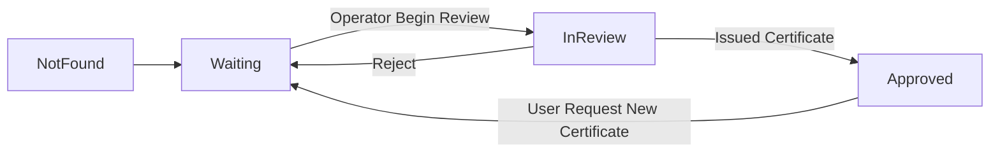

<!-- START doctoc generated TOC please keep comment here to allow auto update -->
<!-- DON'T EDIT THIS SECTION, INSTEAD RE-RUN doctoc TO UPDATE -->
**Table of Contents** 

- [Targets:](#targets)
- [Prerequisites](#prerequisites)
- [I. Blockpass API](#i-blockpass-api)
  - [1. Handshake](#1-handshake)
  - [2. Refresh AccessToken](#2-refresh-accesstoken)
  - [3. Query BlockpassProfile](#3-query-blockpassprofile)
  - [4. Single Sign on Complete](#4-single-sign-on-complete)
  - [4. Send user online push-notification](#4-send-user-online-push-notification)
- [II. Certificate Format](#ii-certificate-format)
- [III. Service Endpoints](#iii-service-endpoints)
  - [1. /status](#1-status)
  - [2. /register and /login](#2-register-and-login)
  - [3. /uploadData:](#3-uploaddata)
  - [4. /resubmit:](#4-resubmit)
- [III. MobileApp Data Exchange:](#iii-mobileapp-data-exchange)
  - [1. KycRecordStatus:](#1-kycrecordstatus)
  - [2. Multipart-UploadData](#2-multipart-uploaddata)
  - [3. Available Identity fields And Certificates:](#3-available-identity-fields-and-certificates)
    - [3.1 Identities Slug](#31-identities-slug)
    - [3.1.1 Address Json format (V1.3+)](#311-address-json-format-v13)
    - [3.1.2 Phone Json format (V1.3+)](#312-phone-json-format-v13)
    - [3.2 Certificate Slug](#32-certificate-slug)
    - [3.3 onfido-service-cert (Version 1.2+)](#33-onfido-service-cert-version-12)
    - [3.4 complyadvantage-service-cert (Version 1.2+)](#34-complyadvantage-service-cert-version-12)
    - [3.5 onfido (Before Version 1.2) [deprecated]](#35-onfido-before-version-12-deprecated)
  - [4. Mobile App <-> Service 's Endpoints flow chart](#4-mobile-app---service-s-endpoints-flow-chart)

<!-- END doctoc generated TOC please keep comment here to allow auto update -->

## Changelog
- Endpoints updates:

`/api/v0.3/oauth2/token`=> `/api/3rdService/token/generate` 

`/api/v0.3/service/renewStoc`=> `/api/3rdService/token/renew` 

`/api/v0.3/oauth2/profile`=> `/api/3rdService/user` 

`/api/v0.3/service/complete`=> `/api/3rdService/register/complete` 

`/api/v0.3/certificate_new/feedBack` => `/api/3rdService/feedBack`

- Response format: please see detail below each endpoints

## Targets:
This document gives a brief introduction on how to integrate your backend with Blockpass system.
- First we introduce some [Blockpass APIs](#blockpass-api) (**yes, we provided these APIs**) which let Services create a user session, query user info and notify user when login/registration finishes.
- Then we describe the [4 endpoints](#ii-service-endpoints) that **need to be implemented on Service backend**. 
- The data structure for the 4 endpoints' request parameter and response can be found in the [final section](#iii-mobileapp-data-exchange).

## Prerequisites
Service backend will need following information to connect with Blockpass APIs:
- `$CLIENT_ID`: ID for Service
- `$CLIENT_SECRET`: secret key used to generate handshake session
- `$BASE_URL`: base url to request Blockapss APIs (Blockpass APIs Host)

At the moment these information will be provided directly from Blockpass team. Later Services can use Blockpass Developer page to generate these infos respectively.

Service side will need to give Blockpass team the list of required KYC fields that they want User to provide (eg name, dob, selfie, Onfido certificate etc...)


## I. Blockpass API

### 1. Handshake

**Purpose**: 
* Authorize with Blockpass server (using `auth code` provided by mobile app). If this code is correct Blockpass server will return `BlockpassToken`

**Endpoint**: `/api/3rdService/token/generate`

**Method**: POST

**Header**:
* Content-Type: application/json

**Body(json)**:
* client_id: `$CLIENT_ID`
* client_secret: `$CLIENT_SECRET`
* code: Blockpass Mobile auth code
* grant_type: must be `authorizationcode`
* session_code (optional): SSO SessionCode

**Response**: 
* **BlockpassToken** (JSON):
``` javascript
{ status: 'success',
  refId: '3943d01f-b4ad-42b0-b90c-73c351b7496f',
  data:
   { access_token: '...',
     token_type: 'Bearer',
     expires_in: 60,
     refresh_token: '...' 
   } 
}
```

### 2. Refresh AccessToken

**Purpose**: 
* Re-issue a new `BlockpassToken`

**Endpoint**: `/api/3rdService/token/renew`

**Method**: POST

**Body(json)**:
* stoc: `BlockpassToken.access_token`
* stoc_refresh: `BlockpassToken.refresh_token`
* client_secret: `$CLIENT_SECRET`

**Response**: 
* Renew **BlockpassToken** (JSON):
``` javascript
{ status: 'success',
  refId: 'ff6052c0-8b69-4acd-ac28-5f16262347b6',
  data:
   { access_token: '...',
     token_type: 'Bearer',
     expires_in: 60,
     refresh_token: '...' 
   } 
}
```

### 3. Query BlockpassProfile

**Purpose**: 
* Query User Blockpass Profile, requires a `BlockpassToken`

**Endpoint**: `/api/3rdService/user`

**Method**: GET

**Header**:
* Content-Type: application/json
* Authorization: `BlockpassToken.access_token`

**Response**: 
* **KycProfile** (JSON):
``` javascript
{ 
  status: 'success',
  refId: '906984ca-4a7f-4b9e-9b42-664efadca5dc',
  data:
   { id: '5bd3015f4df6',
     email: 'email_hash',
     smartContractId: '665981d0-d916-11e8-9879-97aaaabf73e4',
     rootHash: 'data_root_hash',
     isSynching: false,
     smartContractAddress: 'eth_address',
     network: 'https://rinkerby.etherscan.io/'
   }
}
```

### 4. Single Sign on Complete

**Purpose**: 
* Single Sign-on completes with Service's `extraData`. Browser will receive that `extraData` via WebSdk

**Endpoint**: `/api/3rdService/register/complete`

**Method**: POST

**Header**:
* Content-Type: application/json
* Authorization: `BlockpassToken.access_token`

**Body(json)**:
* result: should be `success` of `failed`
* custom_data: Json Object as String
``` javascript
{
    session_Code, // SSO Session code
    extraData     // Custom data forward to web-browser
}
```

**Response**: 
* **KycProfile** (JSON):
``` javascript
{ 
  status: 'success',
  refId: '1dbf8e69-c19a-4971-90db-f74164ca389e',
  data: {} 
}
```

### 4. Send user online push-notification

**Purpose**:
* Service use this endpoint to send Online push notification (PN) to user

**Endpoint**: `/api/3rdService/feedBack`

**Method**: POST

**Header**:
* Content-Type: application/json
* Authorization: `BlockpassToken.access_token`

**Body(json)**:

* noti.type: should be 'info' (reserved for future use)
* noty.title: Title of PN message
* noty.mssg: Body of PN message

``` javascript
{
  noti: {
    type: 'info',
    title: 'notification title',
    mssg: 'notification message'
  }
}
```

**Response**:
* (JSON):
``` javascript
{ status: 'success',
  refId: '1a4f1645-9495-4784-84dd-6409197bb342',
  data: {} 
}
```

## II. Certificate Format

- Certificate are digital documents, signed by two organizations:
  1. Issuer: the Service issuing the certificate
  2. Blockpass: countersigning the certificate

- Certificate stored in [JSON-LD format 1.1](https://json-ld.org/spec/latest/json-ld/)
- Certificate signing implementation follows [ld-signature](https://w3c-dvcg.github.io/ld-signatures/)`EcdsaKoblitzSignature2016` 
- Certificate signature is using [ld-signature-chain](https://w3c-dvcg.github.io/ld-signatures/#signature-chains)
- Certificate includes 4 main parts:
  1. Entity: Json object storing hash of identities fields
  2. Organization: Metadata storing infomation about issuer
  3. Claim: The content of the certificate
  4. signature: Signature of issuer and blockpass
- `Claim._customFields`: This object contains the details of the certificate (ex: Onfido data integrity, ComplyAdvantage sanctions check)

- Example Standard Certificate:

``` javascript
{

  // Json-Ld context
  "@context": [
    {
      "@version": 1.1
    },
    "https://sandbox-api.blockpass.org/api/schema/complyadvantage-service-cert",
    "https://w3id.org/security/v2"
  ],

  // EcdsaKoblitzSignature2016
  "signature": [
    {
      "signatureValue": "....",
      "creator": "/b56.....c522d",
      "created": "2018-06-08T06:41:44Z",
      "type": "EcdsaKoblitzSignature2016"
    },
    {
      "signatureValue": ".....",
      "nonce": "sandbox@0.0.1,rinkeby:0x000",
      "creator": "/898....19fd",
      "created": "2018-06-08T06:41:50Z",
      "type": "EcdsaKoblitzSignature2016"
    }
  ],


  "Claim": {
    "_customFields": {
      // .... Custom fields - Certificate result comes here
    },
    "issueDate": "2018-06-08T06:41:44.253Z",
    "reviewBody": "<Summary for certification Entity>"
  },

  // Services meta data
  // Following schema. http://schema.org/Organization
  "Organization": {
    "url": "https://...",
    "logo": "https://.../logo.jpg",
    "legalName": "...",
    "identifier": "<client_id>"
  },

  // Entity fields & hash
  "Entity": {
    "rootHash": "e3b0.....855",
    "dob": "3106.....822a1",
    "givenName": "483.....89b7",
    "familyName": "b0b.....7082",
    "type": "person"
  }
}
```


## III. Service Endpoints

### 1. /status
**Purpose**: 

* Mobile app communicates with Service to query user [KycRecordStatus](#1-kycrecordstatus) status

**Method**: POST
**Header**:
* Content-Type: application/json

**Body(json)**:
* code: `auth code`
* sessionCode (optional): SSO Session Code


**Response(json)**:
* [KycRecordStatus](#1-kycrecordstatus)

**Suggested Flow**: 
1. [Handshake](#1-handshake) using mobile provided `auth code` -> **BlockpassToken**
2. [Query BlockpassProfile](#3-query-blockpassprofile) -> Get **BlockpassProfileId** 
3. Query Your database and generate  [KycRecordStatus](#1-kycrecordstatus) => Return to client
4. Generate SSOPayload and forward to [Single Sign on Complete](#single-sign-on-complete) (optional if sessionCode existed )

Example:
``` javascript
//New user record status 
{
    status: 'notFound',
    message: 'welcome new user. We need below info to continue registration',
    identities: [
        {slug: 'phone', status:''},
        {slug: 'email', status:''}
    ]
}

//Existing user record status 
{
    status: 'waiting|inreview|approved',
    message: 'summary text',
    allowResubmit: true,
    identities: [
        {slug: 'phone', status:'received|rejected| approved|missing'},
        {slug: 'email', status:'received|rejected| approved|missing'}
    ],
    certificates: [
        {slug: 'onfido', status:'received|rejected| approved|missing'}
    ]
}
```

### 2. /register and /login
**Purpose**: 

* Mobile app calls to start registration / login process. Service should return `nextAction` to instruct Mobile app what it should do next
    * `nextAction`: What client should do next:
      * *none*: do nothing
      * *upload*: perform user's data upload (following fields below required)
    * `accessToken`: one-time password using for next action `/uploadData`
    * `requiredFields`: Required Identity fields user must provide
    * `certs`: certificate that Services expects from User **(optional, User can choose whether to send or not)**

* Note: 
    * More information on `requiredFields` & `certs` can be found in section [Fields and Certificates](#1-available-identities-and-certificates)
    * `requiredFields` and `certs` list must be approved by Blockpass. If not Mobile application will **decline sending those data to Service**.
    * `/register` will be called when User presses Register on Mobile App. **sessionCode is not included in the request**.
    * `/login` will be called when Mobile App consumes QR code via Website. 

**Method**: POST

**Header**:
* Content-Type: application/json

**Body(json)**:
* code: `auth code`
* sessionCode (optional) : SSO Session Code

**Response(json)**:
``` javascript
{
    nextAction: 'upload',
    accessToken: '...', // one-time password for uploading data
    requiredFields: ['phone', 'email'], 
    certs: ['onfido']
}
```

**Suggested FLow**: 
1. [Handshake](#1-handshake) using Mobile's `auth code` -> **BlockpassToken**
2. [Query BlockpassProfile](#3-query-blockpassprofile) -> Get **BlockpassProfileId** 
3. Generate SSOPayload and forward to [Single Sign on Complete](#single-sign-on-complete) (optional if sessionCode is existed AND Profile is in good status)
4. Query Your database and generate  [KycRecordStatus](#1-kycrecordstatus) => Base on that status. Generate submit data session: 
    * accessToken: one-time password for next `uploadData` session 
    * requiredFields, certs: List of fields or certificate Service needs user to provide

### 3. /uploadData: 
**Purpose**: 
* Mobile app checks for required fields, asks for User permission and upload data and certificate (optional)) to Service

**Method**: POST

**Header**:
* Content-Type: multipart/form-data

**Body(multipart/form-data)**:
* [Multipart-UploadData](#2-multipart-uploaddata)

**Response(json)**:
``` javascript
{
    nextAction: 'none', // Finish
}
```

**Suggested Flow**: 
1. Check `accessToken` and restore uploadData session. Which created above on `/login` or `/register` endpoints
2. Consume User raw-data 
3. Generate SSOPayload and forward to [Single Sign on Complete](#single-sign-on-complete) (optional if sessionCode existed from uploadData session - redirect from `/login` )

### 4. /resubmit:
**Purpose**:
* Mobile app(1.3+) detect user identities change / missing (compare with latest data submited to service). If any change detected. Button *ReSubmit* will show allow user update those changes to services

**Method**: POST

**Header**:
* Content-Type: application/json

**Body(json)**:
* code: `auth code`
* fieldList: [string]. List of identities changed
* certList: [string]. List of certificate changed

**Response(json)**:
``` javascript
{
    nextAction: 'upload',
    accessToken: '...', // one-time password for uploading data
    requiredFields: ['phone', 'email'],
    certs: ['onfido']
}
```

**Suggested Flow**: 
1. [Handshake](#1-handshake) using Mobile's `auth code` -> **BlockpassToken**
2. [Query BlockpassProfile](#3-query-blockpassprofile) -> Get **BlockpassProfileId** 
3. Check current KycStatus dose it allow user reSubmit data ( if not return `nextAction: 'none'`)
4. Generate submit data session:  
    * accessToken: one-time password for next `uploadData` session 
    * requiredFields, certs: List of fields and certificate Service want consumed from user


## III. MobileApp Data Exchange:

### 1. KycRecordStatus:

Object stored kycRecord status following Mobile App format

``` javascript
// Format
{
    status: 'notFound|waiting|inreview|approved',
    message: 'text summary current status',
    createdDate: 'DateTime KycRecord created',
    allowResubmit: true,
    identities: [
        {
            slug: 'slug name',
            status: 'received|rejected|approved|missing',
            comment: 'reviewer comment'
        },
        //....
    ],
    certificates: [
        {
            slug: 'slug name',
            status: 'received|rejected|approved|missing',
            comment: 'reviewer comment'
        },
        //....
    ]
}
```

`allowResubmit` (V1.3+): 

| Status   | Description                                    |
| -------- | --------------------------------------------- |
| True     | Mobile app will show Resubmit button if any identities / certificate change detected |
| False    | 'Resubmit button now showed'. (Ex: during KYC profile underReview / approved )       |

`KycRecordStatus.status` tables: 

| Status   | Description                                    |
| -------- | --------------------------------------------- |
| notFound | User has not registered with this Service     |
| waiting  | Waiting for user data to be uploaded completely    |
| inreview | User identity is in review                    |
| approved | Review process is success, (Service may proceed to issue Certificate to User) |

State Transition:





`KycRecordStatus.Identities.status` tables:

| Status   | (Identities or Certificate).status | Description             |
| -------- | ---------------------------------- | ------------------------|
| notFound | empty        | User has not registered with this Service     |
| waiting  | received     | User data has been successfully uploaded      |
|          | missing      | User data corrupts (mostly by network problem in previous upload session)         |
| inreview |              | User identity is in review process            |
|          | rejected     | User identity is rejected. Notice user to reupload. In this case Service must provide reason in `KycRecordStatus.Identities.comment` field |
|          | approved     | User identity is accepted                     |
| approved | *            | Review process is done (Service may proceed to issue Certificate for User)                            |


### 2. Multipart-UploadData


``` 
POST  HTTP/1.1
Host: auth-blockpass.org
Cache-Control: no-cache
Content-Type: multipart/form-data; boundary=----WebKitFormBoundary7MA4YWxkTrZu0gW
------WebKitFormBoundary7MA4YWxkTrZu0gW
Content-Disposition: form-data; name="accessToken"

xxxxxxxxxxxxxyyyyyyyy
------WebKitFormBoundary7MA4YWxkTrZu0gW
Content-Disposition: form-data; name="phone"

090123456
------WebKitFormBoundary7MA4YWxkTrZu0gW
Content-Disposition: form-data; name="email"

abc@def.com
------WebKitFormBoundary7MA4YWxkTrZu0gW
Content-Disposition: form-data; name="selfie"; filename="image.svg"
Content-Type: image/svg+xml


------WebKitFormBoundary7MA4YWxkTrZu0gW--
```

### 3. Available Identity fields And Certificates:

#### 3.1 Identities Slug

| Name              | Type          | Description |
| --------          | --------      | ----------- |
| email             | String        | Email       |
| family_name       | String        | Family name       |
| given_name        | String        | Given name       |
| phone             | String        | Mobile Phone number       |
| selfie            | Binary        | Selfie images       |
| passport          | Binary        | Passport images       |
| proof_of_address  | Binary        | Proof of address image       |
| dob               | String        | Birthday       |
| address           | Json String   | Address     |

Example:

``` javascript
{
    "identities" : {
    "address" : '{"address":"Street","extraInfo":"Addition info","city":"City","state":"AL","postalCode":"700000","country":"USA"}',
    "dob" : "05/24/2005",
    "email" : "hutbs@os.ks",
    "firstName" : "Pop",
    "lastName" : "Eye",
    "passport" : "5af16a902b6aac0011574937",
    "phone" : '{"countryCode":"VNM","countryCode2":"vn","phoneNumber":"+84987543212","number":"987543212"}',
    "picture" : "....",
    "proofOfAddress" : "....."
    }
}
```

#### 3.1.1 Address Json format (V1.3+)

| Name              | Type          | Description    |
| --------          | --------      | -----------    |
| address           | String        | Address line 1 |
| extraInfo         | String        | Additional info about user address |
| city              | String        | City info |
| state (optional)  | String        | State (depend on country) |
| postalCode        | String        | Postal code |
| country           | String        | ISO(3 letter) country code |

Ref:

- Country code list: [https://countrycode.org/](https://countrycode.org/)

#### 3.1.2 Phone Json format (V1.3+)

| Name              | Type          | Description    |
| --------          | --------      | -----------    |
| phoneNumber       | String        | Phone number with country code prefix (`+<code><number>`) |
| number            | String        | Phone number without country code prefix |
| countryCode2      | String        | ISO(2 letter) country code |
| countryCode       | String        | ISO(3 letter) country code |

#### 3.2 Certificate Slug

| Name                        | Type          | Description |
| ------------------------    | --------      | ----------- |
| onfido                      | String        | Onfido certificate (deprecated)       |
| onfido-service-cert         | String        | Onfido certificate (standard format)       |
| complyadvantage-service-cert| String        | Onfido certificate (standard format)               |

#### 3.3 onfido-service-cert (Version 1.2+)

- This certificate contains results from a [Standard Onfido Check](https://documentation.onfido.com/#identity-verification)

- `Claim._customFields.result`: Onfido summary result

| Name  | Description |
| ----  | ----------- |
| clear | Data sent to Onfido are clear and match with other data. Passport seems to be valid and was not stolen. |
| consider | Some verification results returned errors. Check details of results for more informations.   |

- `Claim._customFields.sub_result`: Onfido detailled result

| Name  | Description |
| ----  | ----------- |
| clear | If all underlying verifications pass, the overall sub result will be clear |
| rejected | If the report has returned information where the check cannot be processed further (poor quality image or an unsupported document).            |
| suspected | If the document that is analysed is suspected to be fraudulent.            |
| caution | If any other underlying verifications fail but they don’t necessarily point to a fraudulent document (such as the name provided by the applicant doesn’t match the one on the document)            |

Example:

``` javascript
{
  "signature": [
    {
      ....
    }
  ],
  "Claim": {
    "_customFields": {

      // Breakdown for Onfido check
      "breakdown": {
        "police_record": {
          "result": "clear"
        },
        "image_integrity": {
          "breakdown": {
            "supported_document": {
              "result": "clear"
            },
            "image_quality": {
              "result": "clear"
            }
          },
          "result": "clear"
        },
        "visual_authenticity": {
          "breakdown": {
            "other": {
              "result": "clear"
            },
            "face_detection": {
              "result": "clear"
            }
          },
          "result": "clear"
        },
        "data_validation": {
          "breakdown": {
            "mrz": {
              "result": "clear"
            },
            "gender": {
              "result": "clear"
            },
            "expiry_date": {
              "result": "clear"
            },
            "document_numbers": {
              "result": "clear"
            },
            "document_expiration": {
              "result": "clear"
            },
            "date_of_birth": {
              "result": "clear"
            }
          },
          "result": "clear"
        },
        "data_consistency": {
          "breakdown": {
            "nationality": {
              "result": "clear"
            },
            "last_name": {
              "result": "clear"
            },
            "issuing_country": {
              "result": "clear"
            },
            "gender": {
              "result": "clear"
            },
            "first_name": {
              "result": "clear"
            },
            "document_type": {
              "result": "clear"
            },
            "document_numbers": {
              "result": "clear"
            },
            "date_of_expiry": {
              "result": "clear"
            },
            "date_of_birth": {
              "result": "clear"
            }
          },
          "result": "clear"
        },
        "data_comparison": {
          "breakdown": {
            "last_name": {
              "result": "clear"
            },
            "issuing_country": {
              "result": "clear"
            },
            "gender": {
              "result": "clear"
            },
            "first_name": {
              "result": "clear"
            },
            "document_type": {
              "result": "clear"
            },
            "document_numbers": {
              "result": "clear"
            },
            "date_of_expiry": {
              "result": "clear"
            },
            "date_of_birth": {
              "result": "clear"
            }
          },
          "result": "clear"
        }
      },
      "variant": "standard",
      "sub_result": "clear",
      "status": "complete",
      "result": "clear"
    },
    "issueDate": "2018-06-08T06:44:00.387Z",
    "reviewBody": "clear"
  },
  "Organization": {
    "url": "https://onfido.com/",
    "logo": "https://asia-api.blockpass.org/api/private/image/onfido_cert_thumbnail.png",
    "legalName": "Onfido",
    "identifier": "onfido_service"
  },
  "Entity": {
    "rootHash": "...",
    "passport": "...",
    "address": "...",
    "phone": "...",
    "dob": "...",
    "givenName": "...",
    "familyName": "...",
    "type": "person"
  },
  "@context": [
    {
      "@version": 1.1
    },
    "https://sandbox-api.blockpass.org/api/schema/onfido-service-cert",
    "https://w3id.org/security/v2"
  ]
}
```

#### 3.4 complyadvantage-service-cert (Version 1.2+)

- This certificate contains results from a Comply Advantage check (documentation not public)
- `Claim._customFields.result`: Comply Advantage summary result

| Name  | Description |
| ----  | ----------- |
| unknown | Name not found in Sanctions and PEP list. |
| no_match | Name not found in Sanctions and PEP list. |
| potential_match | Potential match found in Sanctions and PEP list. |
| false_positive | False positive found in Sanctions and PEP list. |
| true_positive | True positive found in Sanctions and PEP list.   |
| true_positive_apprrove | True positive found in Sanctions and PEP list.   |
| true_positive_reject | True positive found in Sanctions and PEP list.   |


#### 3.5 onfido (Before Version 1.2) [deprecated]

- Certificate is stored in the format below

- Onfido check results are similar to [onfido-service-cert](#31-onfido-service-cert-version-12)

``` javascript
{
  "@context": {
    //...
  },
  "@type": "Person",
  "@did": "bp:5b1a24c105484f3f2165e9e5",

  // Service info
  "service": {
    "name": "Onfido",
    "logo": "/api/private/image/onfido_cert_logo.png",
    "thumbnail": "/api/private/image/onfido_cert_thumbnail.png"
  },

  // Hash of data fields
  "given_name": "b0b...082",
  "family_name": "483...9b7",
  "address": "94c...f90",
  "dob": "310...2a1",
  "phone": "94a...52f",
  "passport": "ec4...6ee",
  "selfie": "57a...860",
  "proof_of_address": "804...213",

  // Onfido standard check report
  "onfido_report": {
    //.....
  }
}
```

### 4. Mobile App <-> Service 's Endpoints flow chart


``` mermaid
graph LR
A[/status] -->|notFound| B{qr.session_code?}
B --> |yes|C[/login]
B --> |no|D[/register]
C--> E[/uploadData?uploadToken]
D -->E[/uploadData?uploadToken]

A --> F{Any fields missing or updated}
F --> |yes|G{status.allowResubmit}
G --> |yes|H[/resubmit]
H --> E[/uploadData?uploadToken]
```