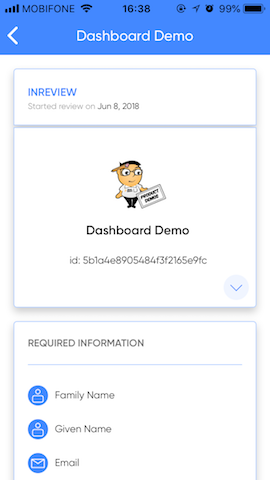
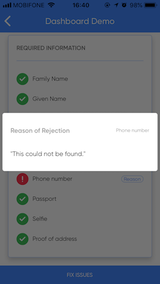
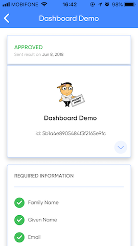
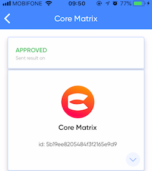
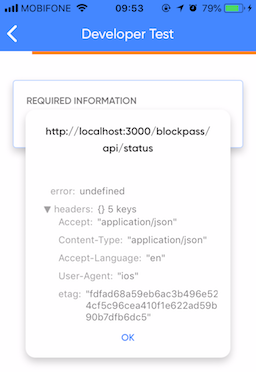

<!-- START doctoc generated TOC please keep comment here to allow auto update -->
<!-- DON'T EDIT THIS SECTION, INSTEAD RE-RUN doctoc TO UPDATE -->
**Table of Contents**

- [Blockpass Mobile 1.2](#blockpass-mobile-12)
  - [Mobile App ChangeLog](#mobile-app-changelog)
  - [SDK ChangeLog](#sdk-changelog)
    - [Critical (must be updated)](#critical-must-be-updated)
    - [Optional (new features)](#optional-new-features)
  - [Steps to upgrade a NodeJS integration](#steps-to-upgrade-a-nodejs-integration)
  - [Steps to upgrade a Python integration](#steps-to-upgrade-a-python-integration)

<!-- END doctoc generated TOC please keep comment here to allow auto update -->

# Blockpass Mobile 1.2

## Mobile App ChangeLog

- Certificate slug ‘onfido’ format `deprecated`

- New format standard for certificate `onfido-service-cert` and `complyadvantage-service-cert` (and future certificates)

- Update UI of service screens

    - User profile under review by service

        

    - Some identity fields user should correct

        

    - Kyc process completed

        

- Display BPID of current user for each service (local and  staging versions only). Click on BPID to copy to clipboard

    

- Display HTTP request error for service API (local and staging versions only)

    

## SDK ChangeLog

### Critical (must be updated)

- add support for new format of certificate “onfido-service-cert”, “complyadvantage-service-cert”  (“onfido” certificate format is deprecated)

### Optional (new features)

- Send push notifications to users via new endpoints
- Reject user fields and add reason of rejection => allow user to fix data and re-upload

## Steps to upgrade a NodeJS integration

- Get the last version of the [Javascript Server SDK](https://github.com/blockpass-org/blockpass-serversdk) (example included)

- **(Critical)** Change configuration to allow reception of new certificates [onfido-service-cert](../SpecV1/Server_Spec_V1#31-onfido-service-cert-version-12) and [complyadvantage-service-cert](../SpecV1/Server_Spec_V1#32-complyadvantage-service-cert-version-12)

``` javascript
// old:
    OPTIONAL_CERTS: ['onfido']

// new:
    OPTIONAL_CERTS: ['onfido', "onfido-service-cert", "complyadvantage-service-cert"]

```

- **(Optional)** Send push notification to user using [SendPushAPI](../SpecV1/Server_Spec_V1#4-send-user-online-push-notification) endpoint

``` javascript

//...

const response = await serverSdk.userNotify({
    title,
    message,
    bpToken: kycRecord.bpToken
})

const { bpToken } = response

// SDK will check if token expired and need to be refreshed
// In that case, we update the kycRecord with new bpToken value
if (bpToken != kycRecord.bpToken) {
    kycRecord.bpToken = bpToken
    await kycRecord.save()
}

```

- **(Optional)** Return user-friendly identity verification status to mobile app. [More details](../SpecV1/Server_Spec_V1#1-kycrecordstatus)

  - `received`: data received by service and under review
  - `approved`: data fields approved by service
  - `rejected`: data rejected by service. Dashboard operator can provide comment
        => Mobile app will prompt user to update rejected fields
  - `missing`: data fields missing - probably due to upload error
        => Mobile app will prompt user to re-upload missing data

``` javascript

//...
async function queryKycStatus({ kycRecord }) {
    const { status, identities, certs } = kycRecord

    const identities_status = Object.keys(identities).map((key) => {
        const itm = identities[key]
        const { slug, status, comment } = itm;
        return {
            slug,
            status,
            comment
        }
    })

    const certs_status = Object.keys(certs).map((key) => {
        const itm = certs[key]
        const { slug, status } = itm;
        return {
            slug,
            status
        }
    })

    return {
        status,
        message: 'This process usually take 2 working days',
        createdDate: new Date(),
        identities: identities_status,
        certificates: certs_status
    }
}
```

## Steps to upgrade a Python integration

- Get the last version of the [service-auth-example-python](https://github.com/blockpass-org/service-auth-example-python)

- **(Critical)** Change configuration to allow reception of new certificates

``` python

# ------------------------
# kyc_record_model.py
# ------------------------

#   Enable new certificates
@staticmethod
    def niceToHaveCertificates():
        return ['onfido', 'onfido-service-cert', 'complyadvantage-service-cert']

#   Return status for two new certificate
def generateCertificateStatus(self):
        res = []

        if self.onfido != None:
            res.append({
                    'slug': 'onfido'
            })
        else:
            res.append({
                    'slug': 'onfido',
                    'status': 'missing'
            })

        if self.onfido_service_cert != None:
            res.append({
                    'slug': 'onfido-service-cert'
            })
        else:
            res.append({
                    'slug': 'onfido-service-cert',
                    'status': 'missing'
            })

        if self.complyadvantage_service_cert != None:
            res.append({
                    'slug': 'complyadvantage-service-cert'
            })
        else:
            res.append({
                    'slug': 'complyadvantage-service-cert',
                    'status': 'missing'
            })

        return res

# ------------------------
# blockpass_handler.py
# ------------------------

@staticmethod
def upload(endpoint):
    # ....

    # recieved two new certificate from client
    onfido_service_cert = fields.get('[cer]onfido-service-cert')
    complyadvantage_service_cert = fields.get('[cer]complyadvantage-service-cert')

```

- **(Optional)** Send push notification to user using [SendPushAPI](../SpecV1/Server_Spec_V1#4-send-user-online-push-notification) endpoint

``` python

# ------------------------
# blockpass_handler.py
# ------------------------

# We should store bpToken to our database

# store this for further query if need
record.bpToken = bp_user_access_token
record.bpRefreshToken = bp_user_refresh_token
# time token expired at
now = datetime.datetime.now()
record.bpExpiredAt = now + datetime.timedelta(milliseconds = bp_user_access_token_expires_in)
  

# ------------------------
# blockpass_http.py
# ------------------------

# Send PN to user
@staticmethod
def sendPN(user_access_token, title, message):
    #....
    # checking if accessToken expired (now > record.bpExpiredAt)
    user_access_token = refreshBlockpassToken(...)

    # send pn to client

@staticmethod
def refreshBlockpassToken(user_access_token, refresh_token, client_secret):
    #.....

```